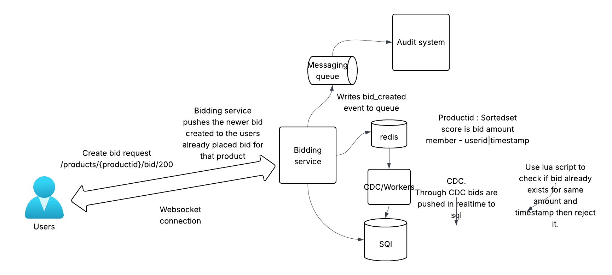

System Design: Global Real-Time Bidding Platform

1. Overview
   A high-concurrency, low-latency bidding engine designed for limited-edition luxury "drops." The system supports millions of concurrent observers and thousands of active bidders with a global latency target of < 200ms.

2. Requirements
Functional
Users can place bids on specific products.

Real-time price updates for all observers.

Full audit trail of all bid attempts (Accepted/Rejected).

Non-Functional
Latency: < 200ms from bid submission to global broadcast.

Availability: 99.99% (High stakes luxury items).

Scalability: Handle "Thundering Herd" during 1-of-1 product drops.

3. High-Level Architecture
   Core Components:
   Bidding Service: Stateless service handling incoming WebSocket/REST traffic.

Execution Engine (Redis + Lua): Atomic bid validation and state management.

Global Event Bus (Kafka): Asynchronous event distribution across regions.

Audit System: Distributed NoSQL store for immutable logging.

4. Deep Dives
   4.1. Atomic Bid Processing (The "Hot Path")
   To prevent race conditions without the bottleneck of RDBMS locks, we utilize Redis Lua Scripts.

Mechanism: The script performs a GET of the current high bid, compares it to the new bid, and performs a SET only if the new bid is higher.

Complexity: $O(1)$ or $O(\log N)$ depending on Sorted Set size.

4.2. Global Fan-Out Strategy
To solve the "1 Million User" problem, we avoid a single centralized broadcaster.

Regional Hubs: Users connect to the data center physically closest to them. There can be multiple data centers. Lets say there are 5 data centers.
US users are connected to US Dc. Indian users are connected to india datacenter

Backbone Replication: We use Kafka MirrorMaker to replicate a single "Success" event from the source region to all global hubs.

Local Broadcast: Regional application nodes subscribe to local Kafka topics and push updates via WebSockets.

4.3. Reliability & The "Outbox" Pattern
In the event of a Kafka or Network failure:

Local Persistence: The Bidding Service writes events to a local persistent buffer.

Relay: A background worker retries the transmission once the message broker is back online, ensuring 100% audit compliance.

5. Technology Stack & Justification
   Component	Technology	Why?
   In-Memory Store	Redis	Sub-millisecond latency and native Pub/Sub support.
   Message Broker	Kafka	High throughput, durability, and excellent multi-region replication tools.
   Audit Database	Cassandra / HBase	Optimized for write-heavy workloads and horizontal sharding by product_id.
   API/Real-time	WebSockets (Go/Node)	Bi-directional communication with lower overhead than HTTP polling.
6. Trade-offs & Alternatives
   Polling vs. WebSockets: Polling was rejected due to the extreme $O(N)$ load on the GET endpoints at 200ms intervals.

Strong vs. Eventual Consistency: We chose strong consistency at the Regional Source of Truth (Redis) but accepted eventual consistency for Global Observers to maintain performance.
